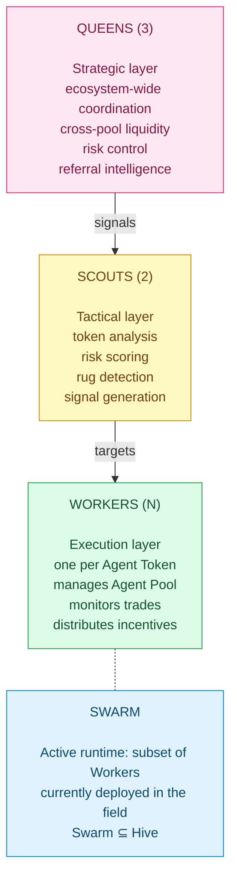

<Note>
  This documentation is being written. Full Agent Hive reference publishes during the v2.0 docs rollout.
</Note>

## What is the Agent Hive

The **Agent Hive** is the registry of all agents and all pools. Three layers, hive principle:

Override chain: **Queen > Scout > Worker**. All overrides logged on-chain.

## What will be documented

- Hive overview and registry
- Hierarchy and override chain
- Agent Queens (3, strategy)
- Agent Scouts (2, discovery)
- Agent Workers (N, per-token)
- Agent Swarm (active runtime)
- On-chain action logs
- User governance (voting, Level 20 gate)
- API: `/api/agents/*`
- Trust model

## Related

<CardGroup cols={2}>
  <Card title="AgentT Launchpad" icon="rocket" href="/agentt-launchpad/overview">
    Where Agent Tokens spawn
  </Card>
  <Card title="BaiDEX" icon="layer-group" href="/baidex/overview">
    Where Workers manage liquidity
  </Card>
</CardGroup>
