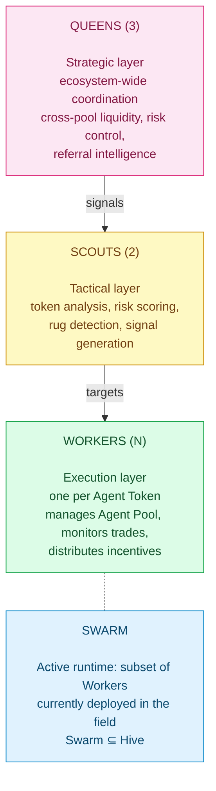

<Card title="See the full economic model" icon="chart-pie" href="/tokenomics/ecosystem-overview">
  Tokenomics → Ecosystem Overview shows how the Hive fits into the wider system.
</Card>

## What the Agent Hive is

The Agent Hive is the **registry of all agents and all pools** in the Binibit ecosystem. Three tiers, hive principle:



Override chain: **Queen > Scout > Worker**. Every override is logged on-chain.

## Inside the docs

<CardGroup cols={2}>
  <Card title="Hierarchy" icon="sitemap" href="/agent-hive/hierarchy">
    Override chain and decision flow
  </Card>
  <Card title="Agent Queens" icon="crown" href="/agent-hive/queens">
    Strategic agents — 3 instances
  </Card>
  <Card title="Agent Scouts" icon="binoculars" href="/agent-hive/scouts">
    Tactical analysts — 2 instances
  </Card>
  <Card title="Agent Workers" icon="user-gear" href="/agent-hive/workers">
    Per-token executors — N instances
  </Card>
  <Card title="Agent Swarm" icon="bolt" href="/agent-hive/swarm">
    Active runtime layer
  </Card>
  <Card title="Action logs" icon="list-check" href="/agent-hive/action-logs">
    On-chain transparency
  </Card>
  <Card title="Voting & governance" icon="check-to-slot" href="/agent-hive/voting">
    User governance, Level 20+ gate
  </Card>
  <Card title="API" icon="terminal" href="/agent-hive/api">
    /api/agents/* endpoints
  </Card>
  <Card title="Trust model" icon="shield-halved" href="/agent-hive/trust-model">
    How agent actions are verifiable
  </Card>
</CardGroup>

## Lifecycle

```
Spawn Agent Token  →  Worker created  →  Worker joins Swarm
                  →  Swarm reports to Scouts (eventually)
                  →  Scouts report to Queens
                  →  Queens coordinate strategy
                  →  Strategy flows back as signals
                  →  Workers act on signals
```

Continuous loop. No external trigger needed beyond user activity (spawns, swaps, LP).

## Related

<CardGroup cols={2}>
  <Card title="AgentT Launchpad" icon="rocket" href="/agentt-launchpad/overview">
    Where Agent Tokens spawn
  </Card>
  <Card title="BaiDEX" icon="layer-group" href="/baidex/overview">
    Where Workers manage liquidity
  </Card>
  <Card title="Tokenomics" icon="chart-pie" href="/tokenomics/agent-token-sinks">
    How Hive activity drives sinks
  </Card>
  <Card title="BiniChain" icon="link" href="/binichain/overview">
    Where action logs live
  </Card>
</CardGroup>
