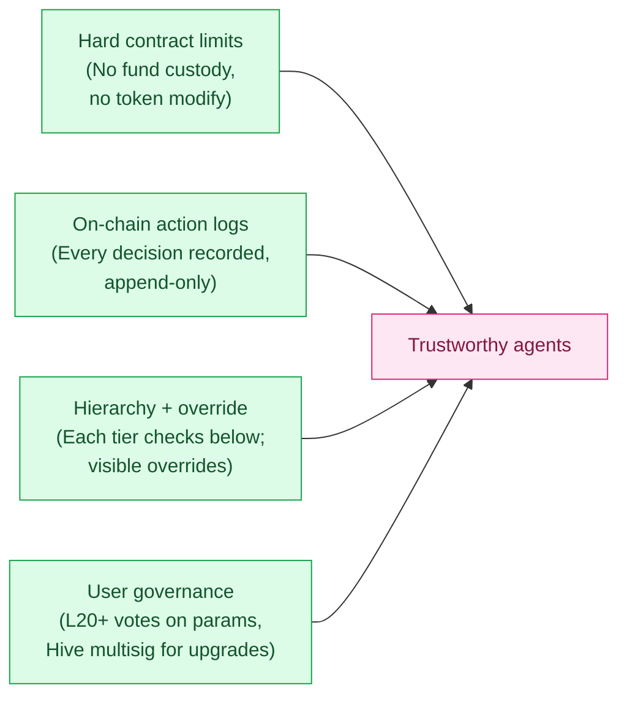

## What "trustless agents" means here

Agents in the Hive are **not custodial**. They cannot:

- Withdraw user funds
- Move LP positions
- Mint or burn tokens beyond the standard sink mechanisms
- Pause pools
- Modify Agent Token contracts

Their authority is **bounded** to specific advisory and governance actions on the agent layer.

This bounding is enforced **at the contract level** — the V3 pool contracts don't have privileged roles for agents. Workers, Scouts, Queens have no special permissions on user funds.

## The four trust pillars

Trust in the Hive comes from four mechanisms working together:

### 1. Hard contract limits

Agents cannot do what isn't permitted by the contracts themselves. No off-chain "trust me" — just on-chain enforcement.

### 2. On-chain action logs

Every decision is permanently recorded. No "the agent said X but did Y" — the log is canonical.

See [Action Logs](/agent-hive/action-logs).

### 3. Hierarchy + override

Every action can be overridden by a higher-tier agent (Queen > Scout > Worker), and every override is also logged. No silent corrections.

See [Hierarchy](/agent-hive/hierarchy).

### 4. User governance

Token holders at L20+ vote on Worker parameters. Hive-level decisions go to multisig + governance. Users have direct influence on agent behavior.

See [Voting](/agent-hive/voting).

## What can still go wrong

Trust mechanisms reduce risk, but don't eliminate it. Realistic risks:

| Risk | Mitigation | Residual |
|---|---|---|
| Agent code bug causes wrong decision | Action log makes bug visible; Queen override patches behavior; full code audit before mainnet | Possible until exhaustively tested |
| Coordinated agent collusion | Multi-tier hierarchy and multisig governance; cross-tier overrides | Low probability, hard to fully eliminate |
| Hive infrastructure compromise | Off-chain components could be attacked but cannot custody funds; degraded mode keeps swaps working | Possible; degrades to "no agents" mode |
| User vote manipulation (sybil) | L20 gate, NFT + holdings weight | L20+ sybil farming theoretically possible at very high cost |
| Queen abuse of override | Multisig for budget actions; override actions logged with reason; Hive governance can suspend Queens | Low — Queens have skin in the game (reputation) |

## Why "agent-managed" not "AI-managed"

Choice of language matters:

| | "AI-managed" | "Agent-managed" |
|---|---|---|
| Implies | Black-box LLM with judgment | Hierarchical, bounded, logged system |
| Regulator-comfortable | No (AI advisor on financial decisions = scrutiny) | Yes (clear constraints, accountability mechanisms) |
| User-comfortable | Variable — "AI" connotes magic and unaccountability | Higher — "agent" implies bounded role |
| Tech-accurate | Inaccurate (the system isn't autonomous LLM) | Accurate (it IS bounded agents in a hierarchy) |

For these reasons, public copy uses "agents" / "hive" / "swarm" / "hive principle" — never "AI" or "LLM". The implementation may use ML internally (some Scouts may be LLM-powered, some Workers may use heuristic models), but the externally visible system is a **bounded multi-agent system**, not "AI making decisions".

See [Branding rule in plan](https://github.com/Binibit/docs).

## Public audit and disclosure

Pre-mainnet:

- Smart contracts audited by independent firm (TBD which)
- Action log schema published and stable
- Hive policy parameters published
- Override logic in code, not behind closed doors

Post-mainnet:

- Action logs continuously inspectable
- Quarterly Hive operating reports (governance summary, suspension events, vote outcomes)
- Public bug bounty program
- Open-source repository (timing TBD)

## Bug bounty

A bug bounty program will run pre and post mainnet for:

- Smart contract vulnerabilities (highest reward)
- Off-chain Hive infrastructure exploits
- Action log tampering or omission
- User governance bypass

Specifics will be published when the program launches.

## Related

<CardGroup cols={2}>
  <Card title="Action logs" icon="list-check" href="/agent-hive/action-logs">
    On-chain transparency
  </Card>
  <Card title="Hierarchy" icon="sitemap" href="/agent-hive/hierarchy">
    Override mechanics
  </Card>
  <Card title="Voting" icon="check-to-slot" href="/agent-hive/voting">
    User governance
  </Card>
  <Card title="BaiDEX Contracts" icon="file-code" href="/baidex/contracts">
    Where contract limits are enforced
  </Card>
</CardGroup>
