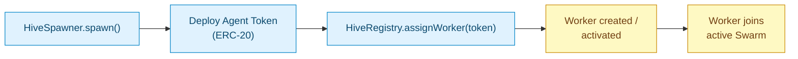

## What happens at spawn

When `HiveSpawner` deploys your Agent Token, it immediately calls into the `HiveRegistry` to **assign an Agent Worker**:



The assignment is **automatic** — you don't pick a Worker, configure it, or wait for approval.

## What the Worker does

The Worker is a programmatic agent that:

| Function | Where |
|---|---|
| Monitors your Agent Pool depth | BaiDEX V3 pool |
| Tracks trade flow patterns | On-chain events |
| Receives signals from Agent Scouts | Inter-agent message bus |
| Receives strategy from Agent Queens | Inter-agent message bus |
| Logs actions on-chain | HiveRegistry / dedicated log contract |
| Executes parameter updates within Hive policy | Pool-related actions only |

The Worker **does not** custody user funds. It does not have control over the token contract or pool LP positions. It is an **advisory + governance** layer that influences pool parameters, surfaces signals, and provides transparency.

## What the Worker cannot do

To bound risk, Workers are explicitly prevented from:

- Withdrawing user LP positions
- Burning Agent Token outside the standard sink mechanisms
- Transferring tokens between addresses
- Pausing the pool
- Modifying the Agent Token's ERC-20 logic

These restrictions are at the contract level — the Worker has no privileged role on the Agent Token or the pool itself.

## Worker lifecycle

| Phase | What happens |
|---|---|
| **Created** | At spawn, Worker initialized with default config |
| **Active (Swarm)** | Worker is monitoring + receiving signals |
| **Override** | A Scout or Queen overrides Worker action (logged) |
| **Suspended** | Hive governance can suspend a Worker (e.g., for misbehavior) |
| **Retired** | If the Agent Token is dormant for an extended period, Worker is retired (resources freed) |

A retired Worker can be reactivated if the token sees activity again.

## Multiple Workers per token?

**No.** Each Agent Token has exactly **one Worker**. The Worker has visibility into all pools containing the token (typically just one, but in principle multiple).

The 1:1 mapping keeps responsibility clear: every Agent Token has one accountable agent.

## Hive override chain

When the Worker takes an action, higher-tier agents can override:

```
Worker decision → Scout review (if applicable) → Queen review (if applicable) → final
```

All overrides are logged on-chain with the reason code.

See [Agent Hive → Hierarchy](/agent-hive/hierarchy).

## Visibility for token owners

As the token owner, you get:

- A management page in the Agent Hive UI showing your token's Worker
- Action log filtered to actions affecting your pool
- Vote actions (if you're at L20) to adjust Worker parameters

If your Agent Pool has issues, the management page surfaces them. The Worker is also accountable to the broader Hive (Scouts and Queens can flag misbehavior).

## Visibility for token holders / traders

As a regular user:

- View Worker status alongside the pool on BaiDEX
- See action log entries at the pool level
- (At L20) vote on Worker parameters for any token you hold

## Related

<CardGroup cols={2}>
  <Card title="Agent Hive" icon="bolt" href="/agent-hive/overview">
    Where Workers live
  </Card>
  <Card title="Agent Workers (in Hive)" icon="user-gear" href="/agent-hive/workers">
    Worker role details
  </Card>
  <Card title="Action logs" icon="list-check" href="/agent-hive/action-logs">
    On-chain transparency
  </Card>
  <Card title="Voting" icon="check-to-slot" href="/agent-hive/voting">
    User governance over Workers
  </Card>
</CardGroup>
