<Card title="See the full economic model" icon="chart-pie" href="/tokenomics/agent-token-sinks">
  Tokenomics → Agent Token Sinks shows how spawn fees and agent pools fit into the BINI economy.
</Card>

## What AgentT Launchpad is

A user-facing factory for **Agent Tokens** — ERC-20 tokens spawned via the Spawner contract that immediately get an Agent Worker assigned and an Agent Pool listed on BaiDEX.

One tap. Everything downstream is automatic.

## What happens when you spawn

```mermaid
flowchart LR
    User["User taps Spawn"] --> Pay["Pays BINI fee<br/>(burned)"]
    Pay --> Deploy["Spawner deploys<br/>ERC-20 Agent Token"]
    Deploy --> Worker["Agent Worker<br/>auto-assigned"]
    Worker --> Pool["Agent Pool<br/>auto-listed on BaiDEX"]
    Pool --> Notice["Agent Scouts notice<br/>(eventually)"]
    Notice --> Strategy["Agent Queens factor<br/>into strategy"]

    classDef user fill:#fce7f3,stroke:#db2777,color:#831843
    classDef burn fill:#fef2f2,stroke:#ef4444,color:#7f1d1d
    classDef chain fill:#e0f2fe,stroke:#0284c7,color:#0c4a6e
    classDef hive fill:#fef9c3,stroke:#ca8a04,color:#713f12

    class User user
    class Pay burn
    class Deploy,Pool chain
    class Worker,Notice,Strategy hive
```

## Inside the docs

<CardGroup cols={2}>
  <Card title="Spawn flow" icon="rocket" href="/agentt-launchpad/spawn-flow">
    Step-by-step: from tap to listed token
  </Card>
  <Card title="Agent Token (ERC-20)" icon="coins" href="/agentt-launchpad/agent-token">
    Token spec: name, symbol, supply, ownership
  </Card>
  <Card title="Auto-Worker assignment" icon="bolt" href="/agentt-launchpad/auto-worker">
    How the Hive picks up your spawn
  </Card>
  <Card title="Agent Pool auto-listing" icon="droplet" href="/agentt-launchpad/agent-pool">
    V3 pool created on BaiDEX automatically
  </Card>
  <Card title="Boost & promotion" icon="fire-flame-curved" href="/agentt-launchpad/boost">
    Surface your token to Scouts and users
  </Card>
  <Card title="Spawn cost" icon="dollar-sign" href="/agentt-launchpad/spawn-cost">
    BINI fee per spawn (burned)
  </Card>
  <Card title="API" icon="terminal" href="/agentt-launchpad/api">
    POST /api/launchpad/spawn and friends
  </Card>
  <Card title="Agent NFT registry" icon="address-card" href="/agentt-launchpad/registry">
    ERC-721 + ERC-8004 registry
  </Card>
</CardGroup>

## How it differs from pump.fun, Virtuals, etc.

| | pump.fun | Virtuals Protocol | AgentT Launchpad |
|---|---|---|---|
| Token deploy | Yes | Yes | Yes |
| Auto-pool | Yes (bonding curve) | Yes | Yes (V3) |
| AI/agent layer | No | Yes | Yes (Hive: Queens, Scouts, Workers) |
| Hierarchy of agents | n/a | Single agent per token | 3-tier (Q/S/W) |
| Pool style | Bonding curve | V2 / curve | V3 (concentrated liquidity) |
| Burn on swap | No | No | Yes (0.25% of every trade) |

The differentiator is the **hive principle**: your Agent Token doesn't get a generic agent assigned in isolation. It joins a **swarm of Workers** coordinated by Scouts and Queens.

## Related

<CardGroup cols={2}>
  <Card title="Agent Hive" icon="bolt" href="/agent-hive/overview">
    The hierarchy that picks up your spawn
  </Card>
  <Card title="BaiDEX" icon="layer-group" href="/baidex/overview">
    Where your Agent Pool lives
  </Card>
  <Card title="Tokenomics: Agent Token Sinks" icon="chart-pie" href="/tokenomics/agent-token-sinks">
    Spawn fee, boost, swap burn
  </Card>
  <Card title="BINI Token" icon="coins" href="/bini-token/overview">
    The currency for spawn fees
  </Card>
</CardGroup>
