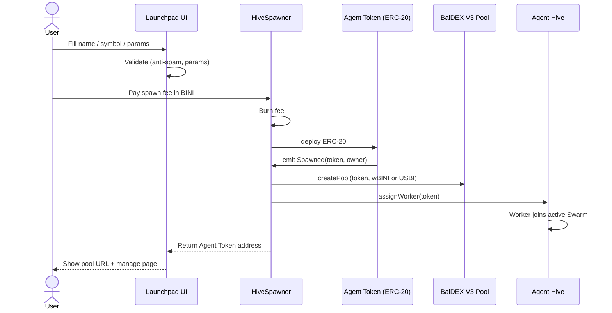

## End-to-end

## Step 1 — fill the form

The Launchpad UI asks for:

- **Name** (e.g., "PepeAgent")
- **Symbol** (e.g., "PEPEA", 3-5 chars)
- **Supply** (default 1B; configurable per project)
- **Decimals** (default 18, ERC-20 standard)
- **Pool side** (default USBI; can choose wBINI if available)
- **Description / metadata** (optional, indexed for the Launchpad explorer)

Defaults work for 90% of cases — you can spawn with just name and symbol.

## Step 2 — anti-spam validation

Before submitting, the UI runs validation:

| Check | Rule |
|---|---|
| Symbol uniqueness | Must not match an existing Agent Token symbol on BiniChain |
| Cooldown | One spawn per address per cooldown window (TBD value) |
| User level (if gated) | TBD — possibly L7 or L10 minimum |
| BINI balance | Must have at least the spawn cost |

If any check fails, the form shows the issue inline.

## Step 3 — pay the spawn fee

Spawn cost is paid in **native BINI** and **fully burned** (sent to a permanent burn address).

The exact amount is being finalized — see [Spawn cost](/agentt-launchpad/spawn-cost).

## Step 4 — Spawner deploys the token

The `HiveSpawner` contract:

1. Deploys a fresh `SpawnedERC20` instance with your params
2. Mints the full supply to your address (you are the initial holder)
3. Emits a `Spawned(address token, address owner)` event
4. Records the new token in the `HiveRegistry` ERC-721/ERC-8004 NFT

Once this completes, you own 100% of the Agent Token's supply. The token is live on-chain.

## Step 5 — pool creation

Spawner immediately calls into the BaiDEX V3 factory to create an `Agent Token / wBINI` or `Agent Token / USBI` pool (depending on the `pool side` parameter).

The pool starts with **zero liquidity** — you (or other LPs) need to deposit to bootstrap trading.

## Step 6 — Worker assignment

The Spawner notifies the Agent Hive that a new token has spawned. The Hive:

1. Selects an available Worker slot (or creates one)
2. Assigns it to your Agent Token
3. The Worker begins monitoring the (currently empty) pool
4. The Worker joins the active **Swarm**

See [Auto-Worker assignment](/agentt-launchpad/auto-worker).

## Step 7 — finished

The UI shows:

- Your Agent Token address
- Pool URL on BaiDEX
- Worker management page in the Agent Hive UI
- Quick actions: bootstrap LP, set up boost, share with community

## Step 8 — bootstrapping liquidity (optional, but recommended)

Empty pools have no useful trading. To bootstrap:

1. Hold both sides (your Agent Token + USBI or wBINI)
2. Provide liquidity in a price range you choose
3. Other users can now swap

See [BaiDEX → Liquidity](/baidex/liquidity) for LP details.

## Reverting / cancelling

You **cannot** un-spawn an Agent Token once the Spawner mines the deploy. The token is on-chain and lives forever.

You **can**:

- Renounce your owner role (transfer to burn address) — makes the token immutable
- Stop providing liquidity — but the pool contract remains
- Burn your own holdings — reduces total supply but doesn't remove the token

The system is designed to be **append-only** for accountability — no spawn-and-delete spam.

## Related

<CardGroup cols={2}>
  <Card title="Spawn cost" icon="dollar-sign" href="/agentt-launchpad/spawn-cost">
    What you pay to spawn
  </Card>
  <Card title="Agent Token spec" icon="coins" href="/agentt-launchpad/agent-token">
    ERC-20 details
  </Card>
  <Card title="Agent Pool" icon="droplet" href="/agentt-launchpad/agent-pool">
    What pool gets created
  </Card>
  <Card title="Auto-Worker" icon="bolt" href="/agentt-launchpad/auto-worker">
    How the Hive picks it up
  </Card>
</CardGroup>
