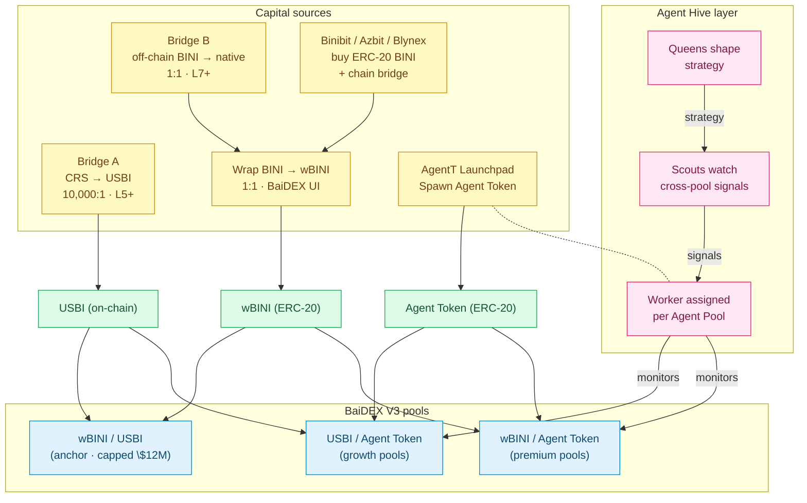

<Card title="See the central economic model" icon="chart-pie" href="/tokenomics/ecosystem-overview">
  Tokenomics → Ecosystem Overview shows where DEX liquidity fits into BINI / wBINI / USBI / CRS flows.
</Card>

## Liquidity flows at a glance



## Becoming an LP

Standard Uniswap V3 mechanics:

1. Acquire both pool sides (e.g., wBINI + USBI for the anchor pool, or USBI + Agent Token for a growth pool)
2. Choose a price range (concentrated liquidity)
3. Approve token spending to the V3 position manager
4. Mint a position NFT — the NFT represents your LP stake
5. Collect fees periodically via `collect()` on your position
6. Remove liquidity by calling `decrease()` and then `burn()`

The position NFT is transferable — you can sell, gift, or use it as collateral in future composable systems.

## Capital sources

### USBI side

USBI for LP comes from your **on-chain USBI balance**, which you got by [Bridge A](/bini-app/usbi-bridge) (CRS → USBI 10,000:1 at L5+).

Maximum USBI you can ever LP per account = your total entitlement = `1,000 + min(XP/10,000, 100,000)`.

Practical implication: a Level 30 user can LP up to ~101K USBI lifetime.

### wBINI side

wBINI for LP comes from **wrapping native BINI** on BiniChain.

To get native BINI:

- Bridge from Ethereum (ERC-20 → native via BiniChain bridge)
- Earn off-chain BINI in Bini App + use [Bridge B](/bini-app/bini-bridge) (1:1, L7+)
- Buy on Binibit Exchange / Azbit / Blynex and bridge

Once you have native BINI, wrap to wBINI via the wBINI contract or BaiDEX UI (1:1, no fee).

### Agent Token side

Agent Tokens come from:

- Spawning your own (AgentT Launchpad)
- Buying via swaps on BaiDEX
- Air-drops, sales, etc. (varies per project)

## Liquidity bootstrapping

When a new Agent Token is spawned, the **Spawner contract auto-creates an Agent Pool** (wBINI/AT or USBI/AT depending on config). It seeds the pool with:

- A small initial wBINI or USBI side from the spawn fee allocation, OR
- Zero initial liquidity (LPs must seed)

The exact bootstrapping policy is set per-launch by the team. Most Agent Tokens will need user-LPs to deposit to bootstrap meaningful trading.

For the anchor wBINI/USBI pool, the team seeded it at TGE using the DEX Liquidity allocation (50M BINI / 5%).

## In-range vs out-of-range liquidity

V3 LPs choose a price range. Earnings depend on whether the current price is in your range:

| State | LP earns? |
|---|---|
| Price is in your range | Yes — earns 0.50% LP fee on swaps that pass through your tick |
| Price moves out of range | No — your liquidity is "asleep" until price returns |

Tighter ranges = higher capital efficiency when in range, higher chance of going out. Wider ranges = lower efficiency but more reliable earnings.

## Impermanent loss

Standard concentrated-liquidity IL applies. For:

- **Stable pairs** (USBI/Agent Token where the AT trades sideways) — moderate IL
- **Volatile pairs** (wBINI/Agent Token, or USBI/AT during price discovery) — higher IL

LPs should size their position based on conviction and time horizon. There is no IL protection mechanism on BaiDEX.

## USBI side scaling

The USBI side of growth pools scales naturally with the user base because:

```
Total USBI in ecosystem ≈ N_users × avg_entitlement_per_user
                       ≈ N_users × ~50,000 (mid-progression typical)
```

| Users | Estimated total USBI | Of which 10% in LP (typical) |
|---:|---:|---:|
| 500 | 25M USBI | 2.5M USBI |
| 1,000 | 50M USBI | 5M USBI |
| 10,000 | 500M USBI | 50M USBI |
| 50,000 | 2.5B USBI | 250M USBI |

The 10% LP assumption is heuristic. Actual deposit rate depends on user behavior.

## wBINI cap interaction

The 50M wBINI cap (5% of BINI supply) constrains how much wBINI can be LP'd across all pools combined.

```
Anchor pool consumes:        ~50M wBINI worth at cap ($6M)
Premium pools consume:       remaining wBINI (any amount up to balance)
```

If users want to LP wBINI in a premium pool while the anchor is at cap, they need wBINI that wasn't sourced from DEX Liquidity allocation — i.e., wrapped from organic BINI buying or staking unlocks.

See [wBINI Cap Rule](/tokenomics/wbini-cap).

## Provider rewards (beyond fees)

LPs earn **just the 0.50% LP fee share** on swaps. There is no additional emission of BINI to LPs from the Rewards pool by default.

If a specific Agent Pool needs liquidity boostrap, the team may allocate emission to incentivize that pool — these are announced per case.

## Removing liquidity

Standard V3:

- Decrease position to receive both sides back proportional to current price
- Burn position NFT after fully decreasing
- Pay BiniChain gas in BINI for the transaction

## Cross-product flow summary

| Step | Where | Page |
|---|---|---|
| Earn CRS | Bini App | [Claim & mining](/bini-app/claim-mining) |
| Spend CRS → XP | Tokenomics | [XP formula](/tokenomics/xp-formula) |
| XP → USBI entitlement | Tokenomics | [USBI formula](/tokenomics/usbi-formula) |
| Bridge CRS → USBI | Bini App / BiniChain | [Bridge A](/bini-app/usbi-bridge) |
| Bridge BINI off → native | Bini App / BiniChain | [Bridge B](/bini-app/bini-bridge) |
| Wrap native → wBINI | BaiDEX | wrap on BaiDEX UI |
| Provide LP | BaiDEX | this page |
| Worker manages pool | Agent Hive | [Workers](/agent-hive/workers) |
| Scout / Queen oversight | Agent Hive | [Hierarchy](/agent-hive/hierarchy) |

## Related

<CardGroup cols={2}>
  <Card title="Pools" icon="droplet" href="/baidex/pools">
    The three pool types
  </Card>
  <Card title="wBINI Cap" icon="shield" href="/tokenomics/wbini-cap">
    Why the cap shapes pool liquidity
  </Card>
  <Card title="USBI Bridge" icon="bridge" href="/bini-app/usbi-bridge">
    Where USBI comes from
  </Card>
  <Card title="BINI Bridge" icon="bridge" href="/bini-app/bini-bridge">
    Where native BINI for wrapping comes from
  </Card>
  <Card title="Agent Workers" icon="user-gear" href="/agent-hive/workers">
    Workers managing your pool
  </Card>
  <Card title="Agent Token Sinks" icon="rocket" href="/tokenomics/agent-token-sinks">
    How spawn fees and trade burns affect liquidity
  </Card>
</CardGroup>
