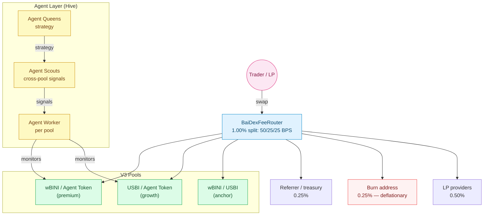

<Card title="See the full economic model" icon="chart-pie" href="/tokenomics/ecosystem-overview">
  Tokenomics → Ecosystem Overview shows how BaiDEX fits into the wider system.
</Card>

## What BaiDEX is

BaiDEX is a **Uniswap V3-compatible AMM** running on BiniChain, with two distinguishing features:

1. **Custom fee router** — 1.00% total fee split into LP / burn / referrer
2. **Agent layer** — every Agent Token pool is managed by an Agent Worker from the [Agent Hive](/agent-hive/overview)

Standard V3 mechanics for liquidity providers. Standard router for swaps. Plus an automatic agent-managed top layer that doesn't exist on other DEXes.

## Headline numbers

| | |
|---|---|
| AMM model | Uniswap V3 fork |
| Fee total | 1.00% (100 BPS) |
| LP share | 0.50% (50 BPS) |
| Burn share | 0.25% (25 BPS) — permanent |
| Referrer share | 0.25% (25 BPS) — or treasury |
| Pool types | wBINI/USBI, USBI/Agent Token, wBINI/Agent Token |
| Smart contracts | See [Contract addresses](/baidex/contracts) |
| Settlement chain | BiniChain |

## Inside the docs

<CardGroup cols={2}>
  <Card title="AMM mechanics" icon="layer-group" href="/baidex/amm">
    V3 fork, concentrated liquidity, tick spacing
  </Card>
  <Card title="Fees" icon="percent" href="/baidex/fees">
    1.00% = 50 LP + 25 burn + 25 referrer (BPS)
  </Card>
  <Card title="Pools" icon="droplet" href="/baidex/pools">
    wBINI/USBI, USBI/AT, wBINI/AT
  </Card>
  <Card title="Liquidity" icon="water" href="/baidex/liquidity">
    LP rules, USBI side scaling, wBINI cap
  </Card>
  <Card title="Trading guide" icon="arrow-right-arrow-left" href="/baidex/trading-guide">
    Swap example via V3 router
  </Card>
  <Card title="Slippage & MEV" icon="shield" href="/baidex/slippage-mev">
    Standard V3 protections
  </Card>
  <Card title="Contracts" icon="file-code" href="/baidex/contracts">
    Smart contract addresses on BiniChain
  </Card>
</CardGroup>

## Quick fee summary

```
Total swap fee:  1.00% (100 BPS)
├── 0.50%  LP providers       (50 BPS)
├── 0.25%  Burned permanently (25 BPS) — deflationary
└── 0.25%  Referrer / treasury (25 BPS)
```

See [Fees](/baidex/fees) for the full breakdown.

## Architecture



## How it differs from Uniswap V3

| | Uniswap V3 | BaiDEX |
|---|---|---|
| Tick math | Standard | Standard |
| Fee tiers | 0.05/0.30/1.00% | Single 1.00% (with custom router) |
| LP share of fee | 100% to LPs | 50% to LPs, 25% burn, 25% referrer |
| Pool management | None — pure AMM | Workers (one per Agent Token pool) layer additional logic |
| Token listing | Anyone can pool any pair | wBINI side capped, USBI side scales with users |

## Related

<CardGroup cols={2}>
  <Card title="AgentT Launchpad" icon="rocket" href="/agentt-launchpad/overview">
    Spawn an Agent Token, get an Agent Pool here
  </Card>
  <Card title="Agent Hive" icon="bolt" href="/agent-hive/overview">
    Workers managing every pool
  </Card>
  <Card title="BiniChain" icon="link" href="/binichain/overview">
    Where BaiDEX runs
  </Card>
  <Card title="Tokenomics: wBINI Cap" icon="shield" href="/tokenomics/wbini-cap">
    Why pool topology matters
  </Card>
</CardGroup>
