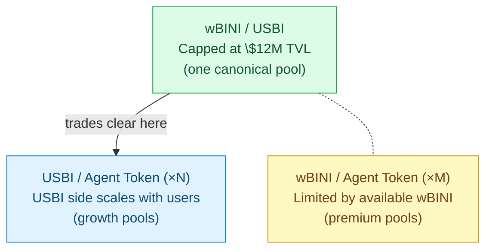

<Card title="Tokenomics view" icon="shield" href="/tokenomics/wbini-cap">
  See Tokenomics → wBINI Cap Rule for why pool topology matters and how the $240M ceiling shapes liquidity flow.
</Card>

## Three pool types

BaiDEX supports three canonical pool configurations:

| Pool type | Role | Liquidity ceiling |
|---|---|---|
| **wBINI / USBI** | Anchor pool — gives USBI a real-value reference | Capped at $12M TVL ($6M wBINI + $6M USBI) |
| **USBI / Agent Token** | Growth pools — primary trading venue for Agent Tokens | Uncapped (USBI side scales with user XP) |
| **wBINI / Agent Token** | Premium pools — Agent Tokens with direct BINI exposure | Limited by remaining wBINI outside anchor |

Other pools (e.g., direct Agent-Token-to-Agent-Token) are technically possible but discouraged by the topology.

## Topology

## wBINI / USBI (anchor pool)

**One canonical pool**, capped at $12M TVL.

The wBINI side caps at $6M (50M BINI × $0.12 reference price). The USBI side mirrors it at $6M to keep the pool balanced.

The anchor pool serves as:

- The **price oracle** for wBINI vs USBI
- The trading venue for users who want to convert between wBINI and USBI directly
- The reference benchmark for off-chain valuations of BINI

LPs in the anchor pool earn the 0.50% LP fee from all swaps that route through it. As DEX volume grows, the anchor sees the highest absolute fee revenue — but is also the most contested LP slot due to the cap.

## USBI / Agent Token (growth pools)

**One per Agent Token**, auto-listed when the token is spawned via [AgentT Launchpad](/agentt-launchpad/overview).

Why USBI as the pair side:

- USBI is a sandbox stablecoin → low volatility relative to fiat
- USBI scales with user XP entitlement → there's always more USBI to LP as user count grows
- No cap on USBI side → these pools can grow large

These are the **primary trading venues** for the bulk of Agent Token activity. Most user trades clear here.

## wBINI / Agent Token (premium pools)

**Optional pools** for Agent Tokens that want direct BINI exposure (and the volatility / opportunity that comes with it).

Why these are limited:

- wBINI total supply is capped at 50M (5% of BINI total)
- The anchor pool consumes a chunk of available wBINI
- Remaining wBINI is split across premium pools

A new wBINI/Agent-Token pool requires either:

- Existing wBINI holders to provide the wBINI side
- Treasury seeding (rare — usually for high-priority projects)

## Liquidity dynamics

| User count | Growth pool USBI side (typical) | Anchor pool TVL |
|---:|---:|---:|
| 500 | $50K | $1-2M (well below cap) |
| 1,000 | $100K | $2-4M |
| 10,000 | $1M | Approaches cap |
| 50,000+ | $10M+ | At cap, overflow to growth pools |

See [Tokenomics → Simulation](/tokenomics/simulation) for projections.

## Permissionless or not?

| | Permissionless? |
|---|---|
| Adding LP to existing pool | Yes |
| Spawning Agent Token (auto-creates pool) | Yes (anyone can spawn) |
| Creating a new wBINI/USBI pool | No (anchor is canonical, single instance) |
| Creating arbitrary new pools (e.g., USBI/USDT) | Effectively no — no infrastructure for non-canonical pools |

## Worker per pool

Every Agent Token pool has a Worker assigned (from [Agent Hive](/agent-hive/overview)). The Worker provides a management layer **on top** of the V3 mechanics:

- Tracks pool depth
- Reacts to Scout signals (e.g., new launches, volume spikes)
- Receives strategy from Queens
- Logs all actions on-chain

Workers do not custody user funds. LPs and traders interact with the V3 contracts directly.

## Related

<CardGroup cols={2}>
  <Card title="Liquidity" icon="water" href="/baidex/liquidity">
    LP rules and bootstrapping
  </Card>
  <Card title="wBINI Cap Rule" icon="shield" href="/tokenomics/wbini-cap">
    Why the topology
  </Card>
  <Card title="AgentT Launchpad" icon="rocket" href="/agentt-launchpad/overview">
    Spawn auto-creates a pool
  </Card>
  <Card title="Agent Hive" icon="bolt" href="/agent-hive/overview">
    Workers managing each pool
  </Card>
</CardGroup>
