<Card title="Tokenomics view" icon="ranking-star" href="/tokenomics/user-levels">
  See Tokenomics → User Levels for the full XP-vs-USBI table for all 30 levels.
</Card>

## What "level" means in Bini App

Your level is your **cumulative engagement score**. It is set by [XP](/tokenomics/xp-formula), and XP comes from CRS spent — so spending CRS (on lessons, bridges, sinks) is what levels you up.

Higher levels unlock:

- More USBI entitlement
- Bridge A (Level 5)
- Bridge B (Level 7)
- Voting on Hive Workers (Level 20)
- Genesis-level rewards (Level 30)

## The 30 levels

Stages from Seed to Genesis:

| Range | Stage | What's typical here |
|---|---|---|
| **L1** | Start | Just signed up, welcome grant in pocket |
| **L2-L4** | Early game | First lesson upgrades, tasting the loop |
| **L5-L7** | Bridge era | Bridge A unlocks at L5, Bridge B at L7 |
| **L8-L10** | Lessons-maxed | Maxing all 30 lessons puts you at L10 (24K USBI) |
| **L11-L14** | Sink era | Lessons done, now spending on bridges and skins |
| **L15-L19** | DEX regular | Active in BaiDEX, maybe spawning Agent Tokens |
| **L20** | Voter unlocks | Can vote on Hive Worker parameters |
| **L21-L29** | Power user | Heavy DEX participation, deep sinks |
| **L30** | Genesis | Max USBI entitlement (101K), max mining rate |

```mermaid
flowchart LR
    L1[L1 · Start] --> L4[L2-L4<br/>Early game]
    L4 -- L5: Bridge A unlocks --> L7[L5-L7<br/>Bridge era]
    L7 -- L7: Bridge B unlocks --> L10[L8-L10<br/>Lessons maxed<br/>24K USBI]
    L10 --> L14[L11-L14<br/>Sink era]
    L14 --> L19[L15-L19<br/>DEX regular]
    L19 -- L20: Voting unlocks --> L29[L21-L29<br/>Power user]
    L29 --> L30[L30 · Genesis<br/>101K USBI · max rate]

    classDef start fill:#fce7f3,stroke:#db2777,color:#831843
    classDef early fill:#fef9c3,stroke:#ca8a04,color:#713f12
    classDef bridge fill:#dbeafe,stroke:#3b82f6,color:#1e3a8a
    classDef mid fill:#dcfce7,stroke:#16a34a,color:#14532d
    classDef power fill:#e0f2fe,stroke:#0284c7,color:#0c4a6e
    classDef max fill:#fef2f2,stroke:#ef4444,color:#7f1d1d

    class L1 start
    class L4 early
    class L7 bridge
    class L10,L14,L19 mid
    class L29 power
    class L30 max
```

## XP thresholds (compact)

| Level | XP required | USBI entitlement (no welcome grant) |
|---:|---:|---:|
| 1 | 0 | 0 |
| 5 | 50,000,000 | 5,000 |
| 10 | 230,000,000 | 23,000 |
| 15 | 400,000,000 | 40,000 |
| 20 | 600,000,000 | 60,000 |
| 25 | 800,000,000 | 80,000 |
| 30 | 1,000,000,000 | 100,000 |

Full table: [Tokenomics → User Levels](/tokenomics/user-levels).

## Unlock matrix

| Level | What unlocks |
|---|---|
| 1 | Mining, claims, lessons, BaiDEX (no level gate to swap) |
| 5 | **Bridge A** — convert CRS to on-chain USBI |
| 7 | **Bridge B** — convert off-chain BINI to native BINI |
| 10 | All-lessons-L10 milestone (cosmetic, plus the high mining rate) |
| 20 | **Vote on Hive Workers** for the Agent Token you've spawned |
| 30 | **Genesis status**, max entitlement |

Other unlocks (skins tiers, lottery participation, franchise tiers) sit between these milestones — see [Franchise](/bini-app/franchise) for the franchise tier tree.

## Time-to-level scenarios

How long to reach each milestone, no skin/lottery spend:

| Cadence | All lessons L10 | Level 20 | Level 30 |
|---|---:|---:|---:|
| 2 claims/day | Day 109 | Day ~240 | Day 352 |
| 3 claims/day | Day 91 | Day ~180 | Day 292 |
| 2 claims + 100 active refs | Day 90 | Day ~205 | Day 316 |
| 2 claims + 500 invited (capped) | Day 88 | Day ~190 | Day 297 |

See [Tokenomics → Simulation](/tokenomics/simulation).

## Strategy by level range

### L1-L4: Get the loop going
Claim every 4h. Buy first lesson. Don't spend on anything but lessons yet.

### L5-L7: Open the bridges
Bridge A unlocks at L5 — use it, it counts as XP. Bridge B at L7 — use it sparingly until you have a target on BiniChain.

### L8-L10: Max the lessons
This is the income-engine peak. After this, your CRS/hour stops growing.

### L11-L20: Strategic sinks
Lessons-maxed = no more rate growth. CRS now goes to bridges, skins, lottery, Agent Token spawn. Each sink is XP — pick whichever fits your strategy.

### L20+: Vote and refine
At L20 you can vote on Hive Workers — useful if you've spawned your own Agent Token. Otherwise just keep grinding sinks.

## Related

<CardGroup cols={2}>
  <Card title="XP Formula" icon="function" href="/tokenomics/xp-formula">
    1 CRS spent = 1 XP earned
  </Card>
  <Card title="User Levels" icon="ranking-star" href="/tokenomics/user-levels">
    Full 30-row XP/USBI table
  </Card>
  <Card title="USBI Bridge" icon="bridge" href="/bini-app/usbi-bridge">
    Unlocks at L5
  </Card>
  <Card title="BINI Bridge" icon="bridge" href="/bini-app/bini-bridge">
    Unlocks at L7
  </Card>
</CardGroup>
