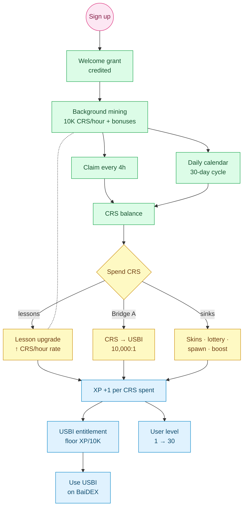

<Card title="See the full economic model" icon="chart-pie" href="/tokenomics/ecosystem-overview">
  Tokenomics → Ecosystem Overview is the central hub. Every formula on this page is documented there.
</Card>

## What is Bini App

Bini App is a **Telegram mini-app** that gamifies entry into the Binibit ecosystem. Users mine **Crystals (CRS)**, level up via **30 lessons**, and bridge into BaiDEX once they hit the right gates.

It is the user-facing on-ramp to the entire ecosystem.

## Headline numbers

| | |
|---|---|
| Levels | 30 (Seed → Genesis) |
| Lessons | 30 lessons × 10 levels = 300 upgrades |
| Mining | Continuous, claim every 4 hours |
| Base mining rate | 10,000 CRS/hour |
| Max mining rate (lessons L10) | 194,650 CRS/hour |
| Welcome grant | See [Onboarding](/bini-app/onboarding) |
| Bridges | A: CRS → USBI · B: BINI off-chain → native |

## How it works (the loop)

## The eight pages

<CardGroup cols={2}>
  <Card title="Onboarding & Welcome Grant" icon="hand-wave" href="/bini-app/onboarding">
    First-session experience and the starter USBI/BINI grant
  </Card>
  <Card title="30 Lessons" icon="graduation-cap" href="/bini-app/lessons">
    Upgrade cards that boost your mining rate
  </Card>
  <Card title="Claim & mining" icon="pickaxe" href="/bini-app/claim-mining">
    Background CRS accrual and 4-hour claim cycle
  </Card>
  <Card title="Levels" icon="ranking-star" href="/bini-app/levels">
    30 tiers from Seed to Genesis
  </Card>
  <Card title="USBI Bridge (A)" icon="bridge" href="/bini-app/usbi-bridge">
    Convert CRS to on-chain USBI at 10,000:1 (Level 5)
  </Card>
  <Card title="BINI Bridge (B)" icon="bridge" href="/bini-app/bini-bridge">
    Convert off-chain BINI to native at 1:1 (Level 7)
  </Card>
  <Card title="Referrals" icon="diagram-project" href="/bini-app/referrals">
    3-level CRS sharing on team mining
  </Card>
  <Card title="Franchise" icon="building" href="/bini-app/franchise">
    Member → Builder → Manager → Director → Partner
  </Card>
  <Card title="Lottery" icon="ticket" href="/bini-app/lottery">
    BINI sink, 60/20/10/10 split (Phase 2)
  </Card>
</CardGroup>

## Where to download

The Bini App is a Telegram mini-app. Open Telegram and search for the official Binibit bot. Verified launch links will be published on [binibit.com](https://binibit.com/?i=7r2c8t).

## Related

<CardGroup cols={2}>
  <Card title="Tokenomics" icon="chart-pie" href="/tokenomics/ecosystem-overview">
    Full economic model
  </Card>
  <Card title="BaiDEX" icon="layer-group" href="/baidex/overview">
    Where USBI and wBINI provide liquidity
  </Card>
  <Card title="BINI Token" icon="coins" href="/bini-token/overview">
    Native ecosystem token
  </Card>
</CardGroup>
