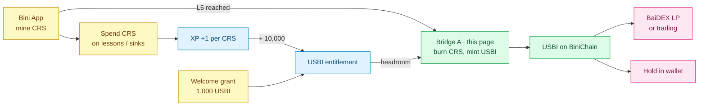

<Card title="Tokenomics view" icon="bridge" href="/tokenomics/usbi-bridge">
  See Tokenomics → USBI Bridge for the formula and entitlement interaction.
</Card>

## What it does

Bridge A converts off-chain Crystals (CRS) into on-chain USBI on BiniChain.

```
10,000 CRS  =  1 USBI
```

Fixed rate. No oracle, no slippage, no fee on the bridge itself.

## Unlock

Bridge A unlocks at **Level 5** (50,000,000 cumulative XP).

Below Level 5, you accumulate USBI entitlement but cannot bridge it on-chain. The gate exists to ensure users have engaged with the app before flowing into BaiDEX.

## How to use it

1. Open the Bini App
2. Navigate to Bridges → USBI Bridge (or similar — exact UI label may differ)
3. Enter the amount of CRS you want to bridge
4. Confirm — the app deducts CRS and mints USBI on your BiniChain address
5. View your USBI on [scan.binibit.com](https://scan.binibit.com) or in your wallet

## Daily limits

- **No daily cap** on bridge amount — limited only by your USBI entitlement and your CRS balance
- The bridge transaction itself executes on-chain → costs **gas in BINI**

## What you can do with bridged USBI

| Use | How |
|---|---|
| Provide liquidity on BaiDEX | Wrap-and-deposit into wBINI/USBI or USBI/Agent Token pools |
| Trade on BaiDEX | Swap USBI for wBINI, Agent Tokens, etc. |
| Hold | Keep in your wallet — USBI is a sandbox stablecoin |
| Send to other addresses | Standard ERC-20 transfer |

## Relationship with USBI entitlement

The bridge does **not** create new entitlement. It draws against your existing entitlement, computed from XP:

```
usbi_entitlement     = floor(total_xp / 10,000)
welcome_grant        = 1,000  (canonical) — value being finalized
total_usbi_available = welcome_grant + usbi_entitlement
claimable            = total_usbi_available - already_bridged
```

But the **CRS you spend on the bridge counts as XP**, which raises your entitlement going forward. So bridging is partly self-funding from an entitlement perspective.

## Example walk-through

1. You have spent 50,000,000 CRS so far
2. XP = 50,000,000 → entitlement = 5,000 USBI (Level 5 unlocks here)
3. Total USBI available = 1,000 (welcome grant) + 5,000 = 6,000 USBI
4. You bridge 10,000,000 CRS = 1,000 USBI
5. Bridge consumes 1,000 of your 6,000 entitlement
6. The 10,000,000 CRS spent counts as XP → new total XP = 60,000,000 → new entitlement = 6,000 USBI
7. Total USBI available = 1,000 (grant) + 6,000 = 7,000 USBI; already bridged 1,000 → claimable 6,000 USBI

## Gas cost

The bridge action is a BiniChain transaction — pay BINI for gas. If you don't have BINI native yet, you'll need to either:

- Wait until you reach Level 7 and use Bridge B to acquire native BINI, or
- Buy BINI on Binibit Exchange / Azbit / Blynex and bridge from Ethereum to BiniChain

## Limits

The maximum lifetime USBI you can bridge equals your maximum entitlement at Level 30:

```
1,000 (welcome grant) + 100,000 (entitlement at L30) = 101,000 USBI lifetime
```

This is independent of how much CRS you spend after Level 30 — XP caps at 1B, so entitlement caps at 100K USBI.

## Cross-product flow



## Related

<CardGroup cols={2}>
  <Card title="Tokenomics: USBI Bridge" icon="bridge" href="/tokenomics/usbi-bridge">
    Formula and full entitlement model
  </Card>
  <Card title="USBI Formula" icon="function" href="/tokenomics/usbi-formula">
    floor(XP / 10K), capped at 100K
  </Card>
  <Card title="BINI Bridge" icon="bridge" href="/bini-app/bini-bridge">
    Bridge B: BINI off → native (L7)
  </Card>
  <Card title="BaiDEX" icon="layer-group" href="/baidex/overview">
    Where USBI provides liquidity
  </Card>
  <Card title="BaiDEX Liquidity" icon="water" href="/baidex/liquidity">
    Provide LP with bridged USBI
  </Card>
  <Card title="BiniChain Bridges" icon="link" href="/binichain/bridges">
    All three bridges in the system
  </Card>
</CardGroup>
