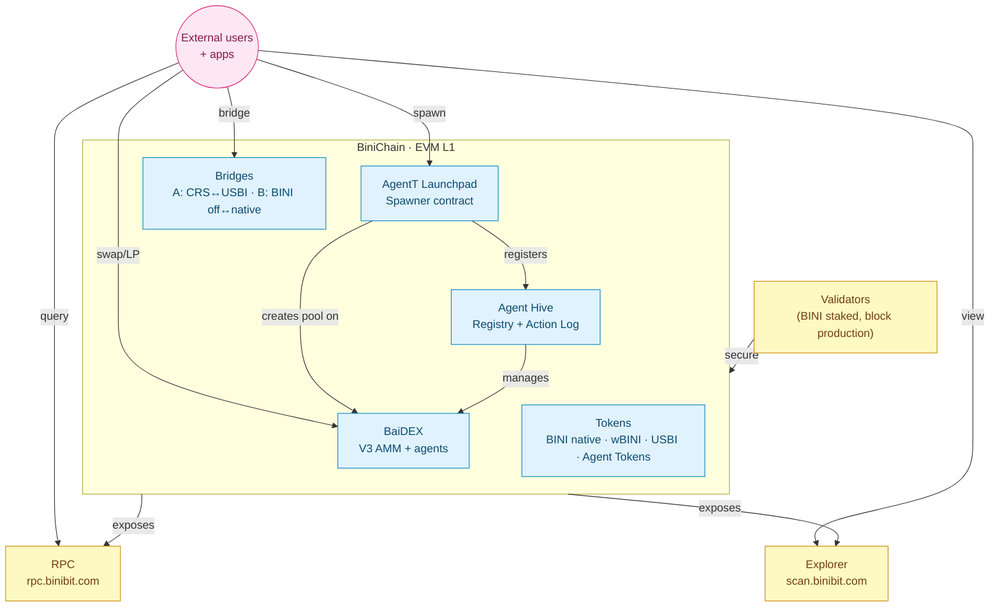

<Card title="See the full economic model" icon="chart-pie" href="/tokenomics/ecosystem-overview">
  Tokenomics → Ecosystem Overview shows how BiniChain hosts the rest of the ecosystem.
</Card>

## What BiniChain is

**BiniChain is an EVM-compatible Layer 1** with **BINI** as its native gas token.

| | |
|---|---|
| Type | EVM L1 |
| Native gas token | BINI |
| RPC | https://rpc.binibit.com |
| Block explorer | https://scan.binibit.com |
| Chain ID | (to be confirmed by chain team) |
| Block time | (to be confirmed by chain team) |

BiniChain hosts:

- **BaiDEX** — agent-managed AMM
- **AgentT Launchpad** — Agent Token spawn factory
- **Agent Hive** — Queens, Scouts, Workers, Swarm
- **Bridge contracts** — Bridge A (CRS↔USBI) and Bridge B (BINI off↔native)
- **Action log contracts** — on-chain transparency for the Hive



## Inside the docs

<CardGroup cols={2}>
  <Card title="Architecture" icon="layer-group" href="/binichain/architecture">
    Consensus, block model, gas mechanics
  </Card>
  <Card title="Network parameters" icon="server" href="/binichain/network-params">
    chainId, RPC, explorer, throttling
  </Card>
  <Card title="Native BINI" icon="coins" href="/binichain/native-bini">
    BINI as gas token
  </Card>
  <Card title="Bridges" icon="bridge" href="/binichain/bridges">
    Bridge A and Bridge B
  </Card>
  <Card title="RPC" icon="terminal" href="/binichain/rpc">
    JSON-RPC endpoints, rate limits, WebSocket
  </Card>
  <Card title="Validators" icon="shield-halved" href="/binichain/validators">
    Validator onboarding (post-mainnet)
  </Card>
  <Card title="Block explorer" icon="magnifying-glass" href="/binichain/explorer">
    scan.binibit.com API
  </Card>
</CardGroup>

## Quick start

Connect to BiniChain RPC:

```javascript
import { ethers } from "ethers";

const provider = new ethers.JsonRpcProvider("https://rpc.binibit.com");
const blockNumber = await provider.getBlockNumber();
console.log("Latest block:", blockNumber);
```

Add BiniChain to MetaMask (when chainId is finalized):

```javascript
await window.ethereum.request({
  method: "wallet_addEthereumChain",
  params: [{
    chainId: "0x...",                              // hex of chainId
    chainName: "BiniChain",
    nativeCurrency: { name: "BINI", symbol: "BINI", decimals: 18 },
    rpcUrls: ["https://rpc.binibit.com"],
    blockExplorerUrls: ["https://scan.binibit.com"]
  }]
});
```

## Related

<CardGroup cols={2}>
  <Card title="BaiDEX" icon="layer-group" href="/baidex/overview">
    AMM running on BiniChain
  </Card>
  <Card title="BINI Token" icon="coins" href="/bini-token/overview">
    Native gas + ecosystem token
  </Card>
  <Card title="AgentT Launchpad" icon="rocket" href="/agentt-launchpad/overview">
    Spawns Agent Tokens on BiniChain
  </Card>
  <Card title="Agent Hive" icon="bolt" href="/agent-hive/overview">
    Action logs live on BiniChain
  </Card>
</CardGroup>
