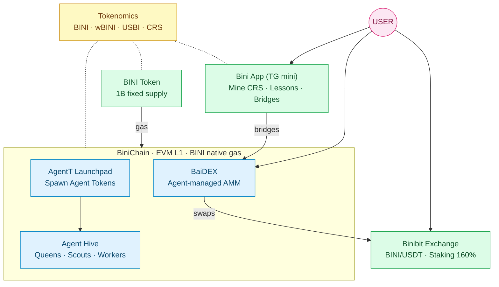

## Welcome

Binibit is a centralized exchange, an EVM Layer 1 chain (**BiniChain**), an agent-managed DEX (**BaiDEX**), an agent hierarchy (**Agent Hive**), an Agent Token launchpad (**AgentT Launchpad**), a Telegram mini-app (**Bini App**), and a native token (**BINI**) — all sharing one economic model.



Pick a product to dive into.

## Products

<CardGroup cols={3}>
  <Card title="Exchange" icon="chart-line" href="/api-reference/introduction">
    Public Spot Market API for the Binibit centralized exchange. CoinGecko-compatible.
  </Card>
  <Card title="BiniChain" icon="link" href="/binichain/overview">
    EVM Layer 1 with BINI as native gas.
  </Card>
  <Card title="BaiDEX" icon="layer-group" href="/baidex/overview">
    Agent-managed AMM. Every token has an agent brain.
  </Card>
  <Card title="AgentT Launchpad" icon="rocket" href="/agentt-launchpad/overview">
    Spawn an Agent Token. The Hive picks it up automatically.
  </Card>
  <Card title="Agent Hive" icon="bolt" href="/agent-hive/overview">
    Queens, Scouts, Workers — hierarchical agent system.
  </Card>
  <Card title="Bini App" icon="mobile" href="/bini-app/overview">
    Telegram mini-app: mine, learn, level up, earn.
  </Card>
  <Card title="BINI Token" icon="coins" href="/bini-token/overview">
    Native token: gas, staking, sinks, rewards.
  </Card>
  <Card title="Tokenomics" icon="chart-pie" href="/tokenomics/ecosystem-overview">
    The shared economic model. Start here for full context.
  </Card>
  <Card title="API Reference" icon="terminal" href="/api-reference/introduction">
    REST endpoints for the Spot Market API.
  </Card>
</CardGroup>

## Quick start

Fetch the latest ticker for `ETH_BTC` from the Spot Market API:

```bash
curl "https://public-api.binibit.com/api/tickers?currencyPairCode=ETH_BTC"
```

## What's documented

All v1 products and reference materials are live. Specific TBD values (chain ID, spawn cost, welcome grant) are clearly marked on the relevant pages.

| Product | Status |
|---|---|
| Exchange + Spot Market API | ✅ Live (v1.0) |
| BiniChain | ✅ Live (v1.0) |
| BaiDEX | ✅ Live (v1.0) |
| AgentT Launchpad | ✅ Live (v1.0) |
| Agent Hive | ✅ Live (v1.0) |
| Bini App | ✅ Live (v1.0) |
| BINI Token | ✅ Live (v1.0) |
| Tokenomics | ✅ Live (v1.0) |

See the [Changelog](/changelog) for the latest updates and the v2.0 trading-API roadmap.

## Highlights

- **Public.** Market data has no authentication, no API key.
- **REST + JSON.** Standard HTTP, predictable schemas.
- **Real-time.** Tickers refresh every few seconds.
- **One ecosystem, one economy.** BINI, wBINI, USBI, and CRS share a single model — see [Tokenomics](/tokenomics/ecosystem-overview).
- **Rate-limited fairly.** Aggregators and integrators get whitelisted on request.

## Status

<CardGroup cols={2}>
  <Card title="Exchange" icon="arrow-up-right-from-square" href="https://binibit.com">
    Live trading interface
  </Card>
  <Card title="GitHub" icon="github" href="https://github.com/Binibit">
    Source for these docs and other open-source repos
  </Card>
</CardGroup>
