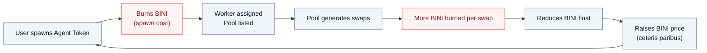

Agent Tokens (AT) created via [AgentT Launchpad](/agentt-launchpad/overview) flow through three BINI-consuming sinks. These sinks scale with Launchpad adoption and add deflationary pressure independent of general BaiDEX activity.

## The three Agent Token sinks

| Sink | Mechanism | Burn? |
|---|---|---|
| **Spawn cost** | Fixed BINI fee paid at spawn | **Yes** (100% burn) |
| **Boost / promotion** | BINI spent to surface a token to Scouts and users | Partial — fee structure TBD |
| **Trade burn (BaiDEX)** | 0.25% of every Agent Pool swap is burned | **Yes** (100% burn) |

## Spawn cost

When a user spawns an Agent Token via AgentT Launchpad, they pay a **fixed BINI fee** that is **fully burned**. This is the primary entry sink.

<Note>
  The exact spawn cost is being finalized by the team. It will be set high enough to deter spam but low enough that genuine creators can spawn.
</Note>

The spawn fee scales with Launchpad usage:

```
Daily BINI burned = (spawns per day) × (spawn cost in BINI)
```

If Launchpad sees 100 spawns/day at a hypothetical 100 BINI/spawn, that's 10,000 BINI/day burned (~$1,200/day at $0.12 reference) just from the spawn flow.

## Boost / promotion

After spawn, creators can **boost** their Agent Token to:

- Increase visibility in the AgentT Launchpad explorer
- Trigger Scout attention sooner
- Get featured on BaiDEX as a highlighted Agent Pool

Boost is paid in BINI. The fee is partly burned and partly retained for platform operations — exact split TBD.

## Trade burn (Agent Pool swaps)

Every swap on an Agent Pool incurs the standard BaiDEX fee:

```
Agent Pool swap fee:  1.00%  (100 BPS)
├── 0.50%  LP providers
├── 0.25%  Burned        ← Agent Token sink (effectively burns wBINI/USBI proportionally)
└── 0.25%  Referrer
```

The 0.25% burn line burns the **input asset of the swap** (wBINI, USBI, or Agent Token). Only the wBINI portion contributes directly to BINI supply reduction; USBI and Agent Token burns shrink their own circulating supply but don't burn BINI directly.

For Agent Pools paired with **wBINI**, the trade burn is a direct BINI sink. For Agent Pools paired with **USBI**, the burn is a USBI sink (and indirectly a downstream BINI sink as USBI is sandbox-bounded).

See [BaiDEX Fees](/baidex/overview).

## Why these sinks matter

The Launchpad creates a positive feedback loop:



The combination of **per-spawn flat burn** + **per-trade volume-scaled burn** means both quantity and quality of Launchpad adoption translate into deflationary pressure.

## Anti-spam considerations

Spam-spawning to farm Worker assignments or game the Hive is mitigated by:

1. **Fixed spawn cost in BINI** — non-trivial to spam
2. **L7+ user gate** to use Bridge B (so spawn-fee BINI must come from earned rewards or open market)
3. **Anti-spam policies on Launchpad** — cooldowns, allowlists, deposit forfeit (TBD)

See [AgentT Launchpad](/agentt-launchpad/overview) for the full anti-spam design.

## Related

<CardGroup cols={2}>
  <Card title="AgentT Launchpad" icon="rocket" href="/agentt-launchpad/overview">
    Spawn flow and Agent Token mechanics
  </Card>
  <Card title="BINI Sinks" icon="fire" href="/tokenomics/bini-sinks">
    All eight BINI sinks in the ecosystem
  </Card>
  <Card title="BaiDEX Fees" icon="percent" href="/baidex/overview">
    1.00% (50/25/25 BPS) split
  </Card>
  <Card title="Agent Hive" icon="bolt" href="/agent-hive/overview">
    Workers that manage Agent Pools
  </Card>
</CardGroup>
