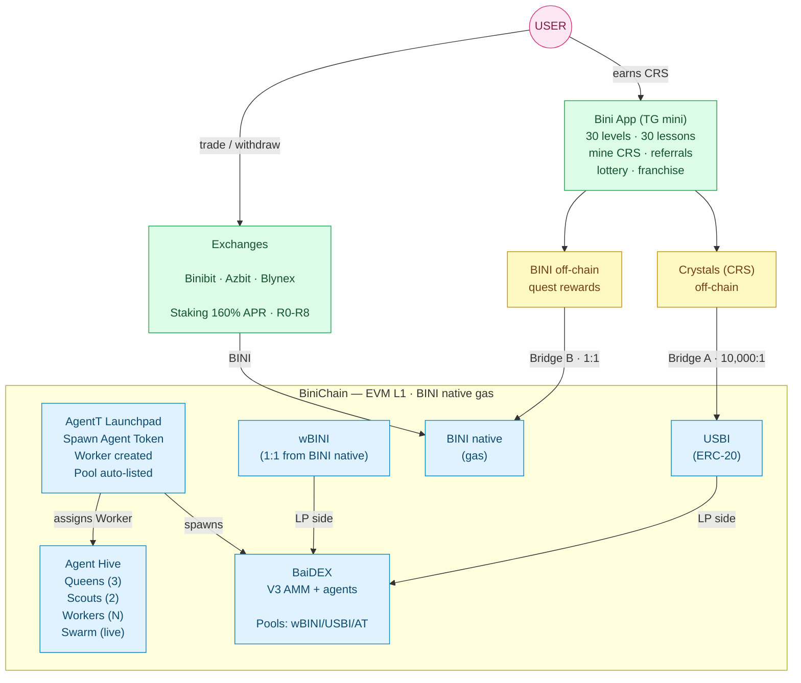

<Note>
  This is the central hub of the Binibit ecosystem documentation. Each product page links back here for the full economic context.

  Each section connects to the relevant product page. See the cards below for the full Tokenomics index.
</Note>

## What you are looking at

Binibit is **a centralized exchange + an L1 chain + a DEX + an agent layer + a Telegram mini-app**, sharing one economic model.



## Assets

| Asset | Type | Value |
|---|---|---|
| **BINI** | Native chain token | Real, $0.12 reference, 1B fixed supply |
| **wBINI** | ERC-20 wrap of BINI | 1:1 with BINI, used in BaiDEX pools |
| **USBI** | ERC-20 stablecoin (testnet $) | 1 USBI = $1 simulation unit |
| **CRS (Crystals)** | Off-chain game points | Virtual, earned in Bini App |

## Bridges

- **Bridge A** — Crystals (CRS) ↔ USBI at **10,000 : 1**, Level 5 gate
- **Bridge B** — BINI off-chain ↔ BINI native at **1 : 1**, Level 7 gate

## Fee structure (BaiDEX)

```
Total swap fee: 1.00% (100 BPS)
├── 0.50%  LP providers  (50 BPS)
├── 0.25%  Burned        (25 BPS) — deflationary
└── 0.25%  Referrer      (25 BPS) — or treasury if none
```

## Lottery split (Bini App, Phase 2)

```
Ticket purchased with BINI:
├── 60%  Jackpot (winners)
├── 20%  Burned permanently
├── 10%  Referral commissions
└── 10%  Platform operations
```

## What will be documented

- Asset model details
- User levels & XP curve (30 levels)
- XP formula (CRS spent = XP)
- USBI formula (`floor(XP / 10,000)`, cap 100,000)
- Lessons (cost & bonus formulas)
- USBI bridge (Bridge A) details
- BINI bridge (Bridge B) details
- BINI emission & vesting
- BINI sinks (8 mechanisms)
- wBINI cap rule
- Agent Token sinks
- Staking & referral economics
- Simulation & cohort projections
- Glossary

## Related

<CardGroup cols={2}>
  <Card title="Bini App" icon="mobile" href="/bini-app/overview">
    Where users earn CRS and unlock USBI/BINI
  </Card>
  <Card title="BINI Token" icon="coins" href="/bini-token/overview">
    Allocation, emission, staking
  </Card>
  <Card title="BaiDEX" icon="layer-group" href="/baidex/overview">
    Trading: pools, fees, agents
  </Card>
  <Card title="Agent Hive" icon="bolt" href="/agent-hive/overview">
    The hierarchy that runs the DEX agent layer
  </Card>
</CardGroup>
